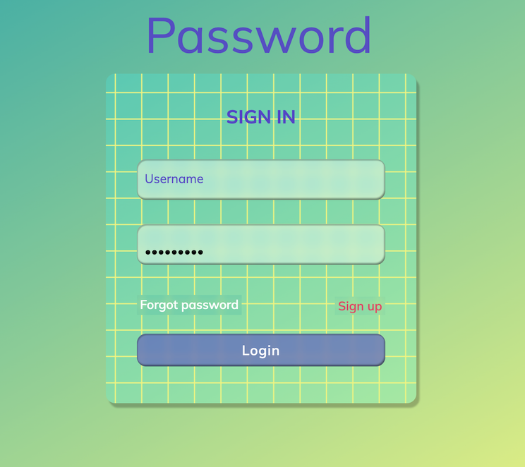

# Form Data

This is an illustrative example of how to handle form data using body-parser and express in Node.js. 
The example is a simple web server that listens for POST requests with form data and logs it to the console.


## Installation

Remember that for the code to work, you need to have Node.js and npm installed on your machine.

1. Clone the repository:
   ```bash
   git clone https://github.com/tpreisig/form-data.git
   ```
2. Navigate to the project directory:
   ```bash
   cd form-data
   ```
3. Install dependencies:
   ```bash
   npm install
   ```

## Usage

To start the project, run:
```bash
npm start
```
The application will be available at `http://localhost:3500`.

The password for any user is 'Ramification'.  
Details can be found here: https://github.com/tpreisig/form-data/blob/main/index.js

or here:

```bash
function accessCheck(req, res, next) {
    if (req.body["password"] === "Ramification") {
        userIsAuthorised = true;
    } else {
        userIsAuthorised = false;
    }
    next();
}
```

## License

This project is licensed under the MIT License - see the [LICENSE](LICENSE) file for details.


## Screenshots



## Contact

Maintained by tpreisig - feel free to reach out!